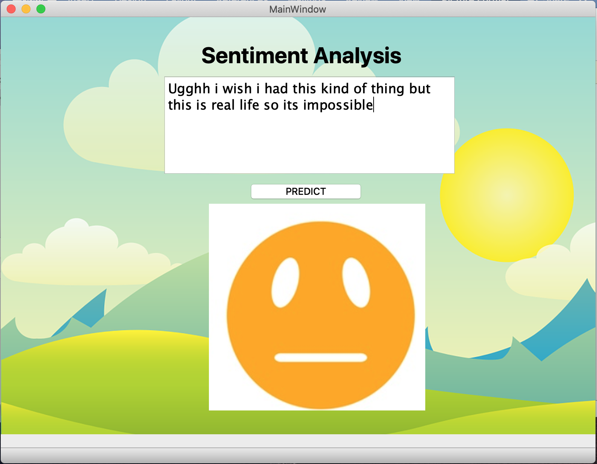
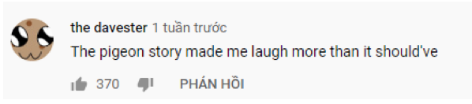
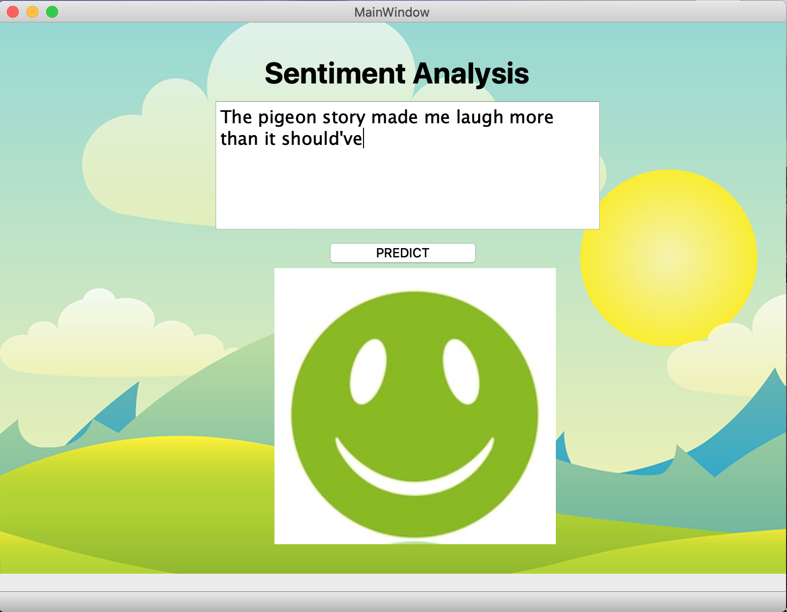

<li> Sentiment Analysis notebook walks through all the processes ranging from exploration, cleaning data to building the entire pipeline then to evaluating model.
<li> deploy_model launches model on PyQt5. To run file, wrap loaded model, CustomTransforme, deploy_model files and images in one folder.

# DEMOS:

### Sad reaction:

### Happy reaction:

